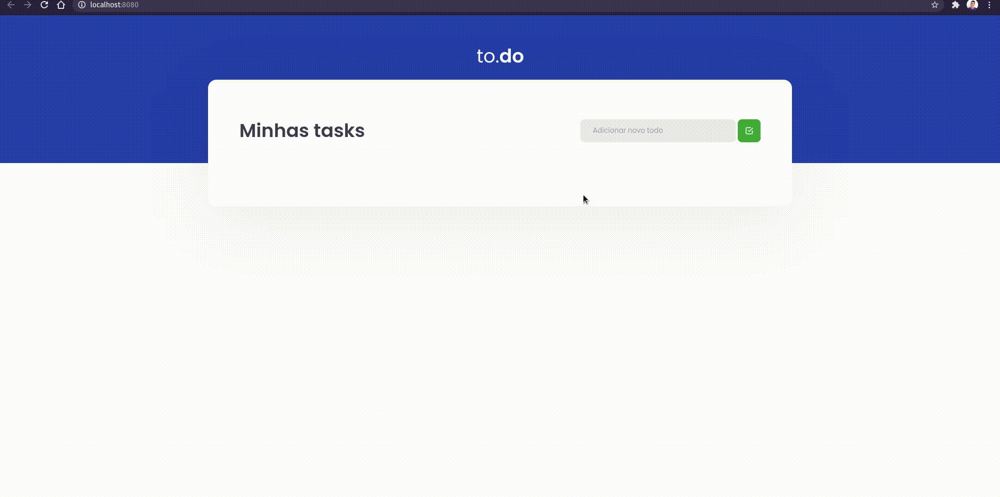

Para esse desafio temos os seguintes testes:

- **`should be able to add a task`**: 
```js
interface Task {
  id: number;
  title: string;
  isComplete: boolean;
}
```

- **`should not be able to add a task with an empty title`**

- **`should be able to remove a task`**

- **`should be able to check a task`**

# Resultado final
<p align="center" style="display: flex; align-items: flex-start; justify-content: center;">
  
</p>
